# Plans for New Accounts

### Will automate 8 accounts per instance --> less online time per account
### Delete old shared_prefs && profiles

# Account guidelines
1. NO participating in real-war clan (or any clans with normal players)
2. <3 hours online per days (<200 wins per season)

# Config Guidelines
1. General Config


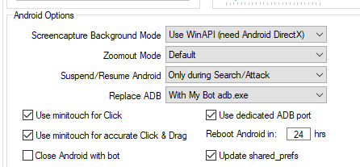


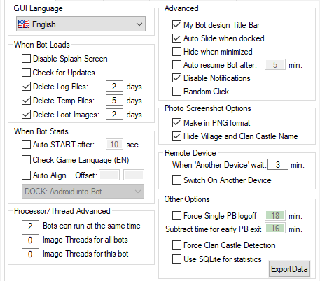


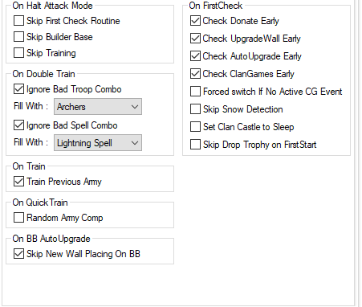


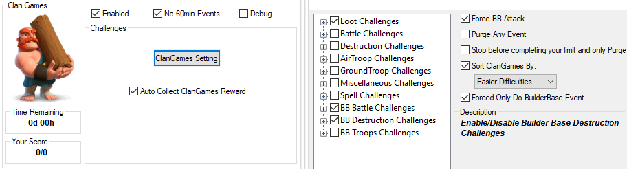


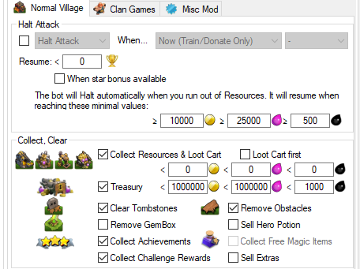


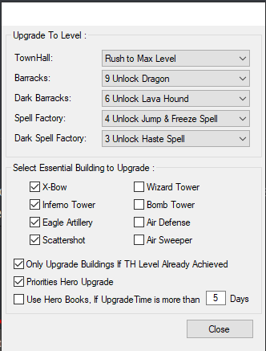


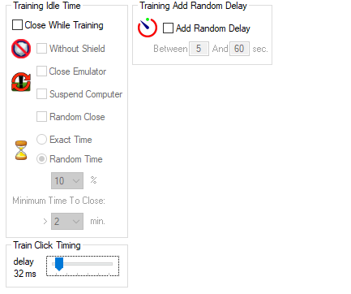


2. For Low level TH Farming (may change when TH is upgraded?)


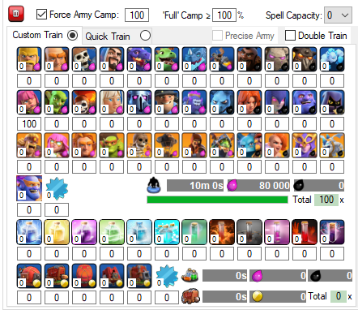


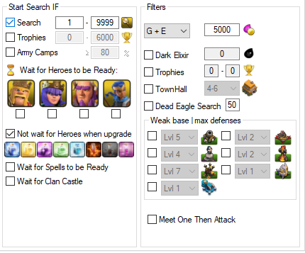


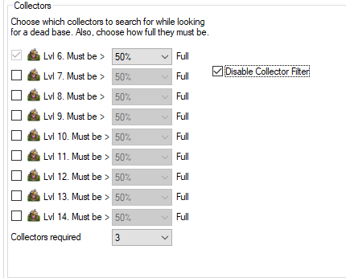


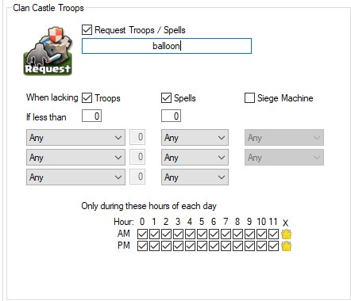


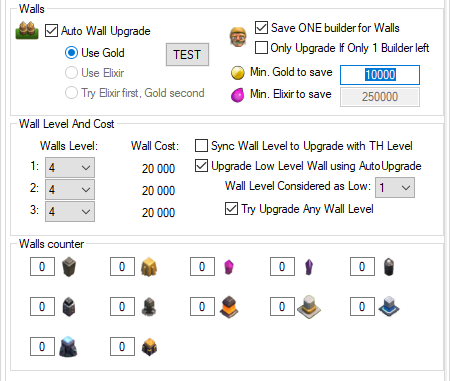


# New accounts plan
- Create manually, name, attach SPC_ID
- gem to get CC
- start farming
- priority: rush TH --> heroes / defense / troops (follow rushTH setting)
- troops compo:


```
Before TH11: Barch
TH11++: Mass SuperBarb
TrophyPush: Lavaloon
``` 
- CC troops:


```
TH2-3-4: Loons
TH5-6: Hog Rider (since Balloons is easy to be targeted)
TH7-8: Giants (frontline for your Barch)
TH9+: SuperBarb
```

- also play BB to get OTTO


# Credits
- Big thanks to Jason and the staff of FU for helping me overcome the disappointment after being "kicked in the ass" and building this config from scratch.