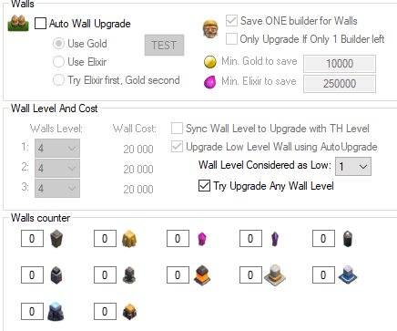

# Plans for New Accounts

### - People should create ~10-16 accounts per instance (Bot will run 1 account for just about 10 minutes --> more accounts --> less online time --> less chance to be "hammered")
### - If you are "hammered" before, it's good to delete all profiles and shared_prefs --> make a new start

# Account guidelines
1. NO participating in real-war clan (or any clans with normal players)
2. < 3 hours online per days (<200 wins per season)
3. Use human-like attack strategy (avoid using normal attacks on higher TH levels)

# Config Guidelines
1. General Config


```
Remember to enable "Background Mode" --> this will enable "Hide Android" + prevent strange errors
```


**CAUTION**: You should locate *buildings* using Manual Locate mode (especially Laboratory)


2. For Low level TH Farming (may change when TH is upgraded)





```
From my perspective (Tee), I think people should focus on rushing rather than wall. 
--> Therefore, I turned off Wall Upgrade in my setting.
```


*Remember to turn off "Use Wall reserve Builder"*


# New accounts plan
- Use Bluestacks Sync Operation or equivalent methods found in MEmu and Nox to speed up the process
- Create manually, name, attach SPC_ID
- Gem to get CC
- Start farming
- Priority: rush TH --> heroes / defense / troops (follow rushTH setting)
- Troops compo:


```
Before TH11: Mass Archers
TH11++: Mass SuperBarb
TrophyPush: Lavaloon
``` 
- CC troops:


```
TH2-3-4: Loons
TH5-6: Hog Rider (since Balloons is easy to be targeted)
TH7-8: Giants (frontline for your Barch)
TH9+: SuperBarb
```

- Also play BB to get OTTO
- Focus on upgrading Giant and Cannon Cart, level up Bomber only to level 10

# Personal Advice
- If you have time, you can combine automation and manual play, since resources in low TH level will overflow quickly, but sometimes bot can not handle that amount.
- Bot with precaution!

# Credits
- Big thanks to Jason and the staff of FU for helping me overcome the disappointment after being "kicked in the ass" and building this config from scratch.
